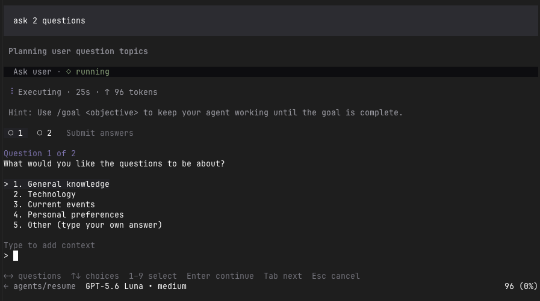

# Prime Agent Plugins

Prime Agent Plugins is a collection of installable extensions and skills for [Prime Agent](https://github.com/PrimeIntellect-ai/prime-agent) and base Pi. Each plugin lives under `plugins/`; the root `pi` manifest loads the collection as one capability package in either harness. The collection includes both native extensions and Python-backed skills that connect to tools already installed on the user's machine.

## Install from GitHub

Install the collection for every project:

```bash
prime-agent package install https://github.com/am-will/prime-agent-plugins
```

Install it only for the current project:

```bash
prime-agent package install https://github.com/am-will/prime-agent-plugins --local
```

Prime Agent discovers the plugin directories from the root `pi` manifest. Restart Prime Agent, or run `/reload`, after installing.

For base Pi, install the same collection for every project:

```bash
pi install https://github.com/am-will/prime-agent-plugins
```

Or install it only for the current project:

```bash
pi install https://github.com/am-will/prime-agent-plugins -l
```

Pi reads the same root manifest. Start a new Pi session or run `/reload` after installing or updating the collection.

For a manual copy of only the ask-user extension, use the extension directory for the harness you want:

```bash
mkdir -p ~/.prime/agent/extensions
curl -fsSL https://raw.githubusercontent.com/am-will/prime-agent-plugins/main/plugins/ask-user/extensions/ask-user.ts \
  -o ~/.prime/agent/extensions/ask-user.ts

mkdir -p ~/.pi/agent/extensions
curl -fsSL https://raw.githubusercontent.com/am-will/prime-agent-plugins/main/plugins/ask-user/extensions/ask-user.ts \
  -o ~/.pi/agent/extensions/ask-user.ts
```

Review plugins before loading them: Prime Agent extensions run with your user permissions.

## Install a specific plugin

This repository is distributed as one Prime Agent package. Install the collection first, then use a package filter to load only the plugin you want. The package is still downloaded as a whole; the filter controls which resources Prime Agent loads.

For a user-wide installation:

```bash
prime-agent package install https://github.com/am-will/prime-agent-plugins
```

For the current project only:

```bash
prime-agent package install https://github.com/am-will/prime-agent-plugins --local
```

Then replace the collection's string entry in the relevant settings file with one of these filtered entries. Filter paths are relative to this repository's root. Use `~/.prime/agent/settings.json` for a user-wide install or `.prime/agent/settings.json` for a project-local install. Keep any other settings in the file unchanged.

Load only `ask_user`:

```json
{
  "packages": [
    {
      "source": "https://github.com/am-will/prime-agent-plugins",
      "extensions": ["plugins/ask-user/extensions/*.ts"],
      "skills": []
    }
  ]
}
```

Load only `trycua`:

```json
{
  "packages": [
    {
      "source": "https://github.com/am-will/prime-agent-plugins",
      "extensions": [],
      "skills": ["plugins/trycua/skills/cua-driver-mcp/SKILL.md"]
    }
  ]
}
```

If you prefer an interactive selector, run `prime-agent config` after installing and disable the resources you do not want. Restart Prime Agent, or run `/reload`, after changing the filter.

## Included plugins

### ask_user

The first Prime Agent Plugins entry is `ask_user`, a focused keyboard-driven questionnaire. It accepts one to five questions in a single interaction and always presents one canonical `Other (type your own answer)` choice for each question. Labels such as `Something else (freeform)` are normalized so the UI never shows both variants. Clients with custom extension UI support keep all questions in one panel; users can type immediately, move between questions with arrows or Tab, and finish with `Submit answers`.

Source: [plugins/ask-user](plugins/ask-user)



*The `ask_user` questionnaire running in Prime Agent.*

Tool input:

```json
{
  "questions": [
    {
      "question": "Which release channel should I use?",
      "options": ["Stable", "Beta"]
    },
    {
      "question": "What should I optimize for?",
      "options": ["Speed", "Safety"]
    }
  ]
}
```

`questions` must contain 1–5 questions. Each `question` may be up to 4,000 characters, and each `options` list must contain 2–12 non-empty choices, each up to 500 characters. Context is user-entered, not a caller-supplied tool field. A single field labeled `Type to add context` sits below the options: for a listed choice its text becomes context, while for `Other (type your own answer)` it becomes the answer itself. Blank text is omitted. If the agent has more than five questions, it can call the tool again.

GooeyPi's GUI/RPC adapter groups the requests into one modal for Pi-family runtimes. Pi or Prime Agent clients that expose only the standard selector API use their native selector fallback; arbitrary extension components require custom UI support from the host.

For example, the result can include:

```json
{
  "answers": [
    {
      "question": "Which release channel should I use?",
      "answer": "Beta",
      "answerSource": "option",
      "context": "Use Beta for the pilot."
    },
    {
      "question": "What should I optimize for?",
      "answer": "A cautious rollout",
      "answerSource": "freeform"
    }
  ]
}
```

### trycua

The `trycua` plugin adds a Python-backed `cua-driver-mcp` skill for people who already use [Try Cua's Cua Driver](https://github.com/trycua/cua). It connects to the local `cua-driver mcp` executable and exposes the upstream driver's native tools through Prime Agent. It does not contain or redistribute Cua Driver source code, binaries, or assets.

Install Cua Driver `0.19.0` or newer from the [upstream project](https://github.com/trycua/cua) first, then install this collection and restart Prime Agent (or run `/reload`). The bridge defaults to `~/.local/bin/cua-driver mcp` and honors a configured `cua-driver` stdio server in `~/.prime/agent/settings.json`. It exposes the typed browser functions documented in the upstream [Drive a Web Page guide](https://cua.ai/docs/how-to-guides/driver/drive-a-web-page), while continuing to forward every live MCP tool.

See the [trycua plugin README](plugins/trycua/README.md) and [cua-driver-mcp skill](plugins/trycua/skills/cua-driver-mcp/SKILL.md) for usage and attribution. Cua Driver is maintained by Cua AI, Inc. and is MIT-licensed; this collection is an independent integration layer.

## Requirements

- Prime Agent 0.7 or newer
- An interactive Prime Agent client for answering questions

Prime Agent provides inherited `@earendil-works/pi-coding-agent` and `typebox` modules at runtime; this collection does not bundle them.

## Adding a plugin

Add the plugin source under `plugins/<name>/`, then add its extension and/or skill directories to the root `pi.extensions` and `pi.skills` lists in `package.json`. Keeping each plugin in its own directory makes the collection easy to inspect and extend.

## License

MIT. See [LICENSE](LICENSE).
